<h1 align="center">🌐 FinGLM</h1>
<!---  <h3 align="center">SMP 2023 ChatGLM 金融大模型挑战赛</h3>
<p align="center">
 --->
</p>
<p align="center">
  <a href="https://tianchi.aliyun.com/competition/entrance/532126">赛题链接</a> |
  <a href="https://tianchi.aliyun.com/specials/promotion/SMP2023ChatGLMChallenge">赛题宣传页</a>
</p>

📃 **FinGLM**:  致力于构建一个开放的、公益的、持久的金融大模型项目，利用开源开放来促进「AI+金融」。

【🔥 2023/11/23 Update】新增了1、2、3代 ChatGLM-6B 模型的课程内容，包括 [PPT](./slides/)、[视频](https://space.bilibili.com/3493270982232856)和[技术文档](https://lslfd0slxc.feishu.cn/wiki/WvQbwIJ9tiPAxGk8ywDck6yfnof)。

【🔥 2023/11/17 Update】新增一个解决方案「[随便取个名](./code/随便取个名)」

---

## 🚀 目录

- [项目介绍](README.md#项目介绍)
- [项目框架](README.md#项目框架)
    - [1. 数据准备流程](README.md#数据准备流程)
    - [2. 模型准备流程](README.md#模型准备流程)
    - [3. 问答流程](README.md#问答流程)
- [开源路线图](README.md#开源路线图)
    - [1. 开源策略](README.md#开源策略)
    - [2. 开源进度](README.md#开源进度)
- [比赛项目](README.md#比赛项目)
  - [0. FinGLM_all](README.md#FinGLM_all)
  - [1. 馒头科技](README.md#馒头科技)
  - [2. 南哪都队](README.md#南哪都队)
  - [3. Chatglm反卷总局](README.md#Chatglm反卷总局)
  - [4. nsddd](README.md#nsddd)
  - [5. 龙盈战队](README.md#龙盈战队)
  - [6. 结婚买房代代韭菜](README.md#结婚买房代代韭菜)
  - [7. TabIsabaopilong](README.md#TabIsabaopilong)
  - [8. 饺子研究院](README.md#饺子研究院)
  - [9. 流宝真人](README.md#流宝真人)
  - [10. 随便取个名](README.md#随便取个名)
- [数据集描述](README.md#数据集描述)
    - [1. 年报数据集](README.md#年报数据集)
        - [PDF下载](README.md#PDF下载)
        - [TXT下载](README.md#TXT下载)
        - [HTML下载](README.md#HTML下载)
        - [使用建议](README.md#使用建议)
    - [2. 标注数据](README.md#标注数据)
- [项目问答演示](README.md#项目问答演示)
- [贡献者](README.md#贡献者)
- [免责声明](README.md#免责声明)
- [项目联系](README.md#项目联系)
---

## 📖 项目介绍
📈 一个旨在深度解析上市公司年报的对话交互智能系统。面对金融文本中的专业术语与暗含信息，我们致力于用AI实现专家级别的金融分析。

🚀 在AI领域，虽然已在文本对话取得进展，但真正的金融交互场景仍然是一个巨大挑战。多方机构联手举办此次竞赛，探索金融领域AI的边界。

📘 上市公司年报为投资者呈现了公司的经营状况、财务状况和未来规划。专业知识是解读的关键，而我们的目标是通过AI技术让这一过程变得更简单、更准确。

---
## 🛠 项目框架

### 1. 数据准备流程
- **[PDF 转 TXT](./tools/pdf_to_txt)**：
  - 转换为 TXT 格式。
  - 保留表格并合并单元格。

- **数据切分**：
  - 基础信息：例如公司名称等。
  - 财务数据：例如资产负债表等。
  - 综合信息：例如财务指标等。

- **数据处理**：
  - 计算基础公式：如营业成本率等。
  - 计算增长率。
  - 计算行业均值和排名。

- **存入数据库**：
  - 存入 SQL、Mongo 和 ES 中。
  - 包括建表及存储。

### 2. 模型微调流程
- **数据分类**：如 SQL 数据、ES 数据等。

- **选择微调策略**：例如 ptuningv2、lora等。

- **执行微调**：根据选定策略。

### 3. 问答流程
- **输入问题**：用户输入问题。
- **Prompt 准备**：根据问题生成 prompt。
- **生成查询语句**：基于 GPU 使用率选择生成方法。
- **查询数据库**：并返回结果。
- **答案生成**：结合问题和查询结果生成答案。

---


## 🌱 开源路线图

### 1. 开源策略

**1) 赛事转型**
* 比赛转型为[学习赛](https://tianchi.aliyun.com/competition/entrance/532126)，允许任何人学习使用。

**2) 数据开源**
* 目前开源数据有 [70G/1w+份年报数据](./data/reports)、[10000条人工标注评测数据](./data/)等。
* 后续我们也将根据项目需求，持续迭代更新数据。

**3) 方案/代码/模型开源**
* 经同意，[结婚买房代代韭菜](./code/结婚买房代代韭菜)、[Chatglm反卷总局](./code/Chatglm反卷总局)、[nsddd](./code/nsddd)、[馒头科技](./code/馒头科技)、[南哪都队](./code/南哪都队)、[龙盈战队](./code/龙盈战队)、[安硕硕眼探企](./code/finglm_all)、[随便取个名](./code/随便取个名)等团队的方案、代码、模型完全开源，纳入FinGLM项目。
* 我们将长期维护优化 [FinGLM 项目](./code/finglm_all)，提供便捷解决方案。

**4) 开放交流**
* 以上团队成员将共同维护 FinGLM项目，确保项目持续迭代。我们也欢迎更多团队来共同贡献问题和方案。
* 我们将不定期组织线上、线下交流，将更优秀的技术推广给每个项目成员。
* FinGLM 开源项目出于完全公益目的，欢迎所有开发者[申请加入](#贡献者)，当然我们会进行严格审核。

**5) 学习教程**
* 基于FinGLM项目的开发，我们将整合并制作以下（包含且不限于）学习教程.
    - 数据预处理教程
    - 数据库使用教程
    - GLM的使用教程
    - Prompt编写教程
    - 模型微调数据准备
    - 模型微调技巧和步骤 
    - 全流程落地

**6) 项目资源池**
* 为了维持项目的健康发展，部分项目组织者（个人和企业）提供 10 万元作为开源项目资金池，以及提供项目算力、数据和模型支持。
* 我们欢迎所有受益于本项目的个人或单位来赞助本项目，包括且不限于以上内容，欢迎[联系我们](#开源赞助)。
 

### 2. 开源进度

**第一期：**
- [X] [组织 SMP 2023 ChatGLM 金融大模型挑战赛](https://tianchi.aliyun.com/competition/entrance/532126)
- [ ] **比赛数据集开源**
  - 年报数据集
    - [X] [PDF 文件](https://modelscope.cn/datasets/modelscope/chatglm_llm_fintech_raw_dataset/summary)。包含 11588 份 2019 年至 2021 年期间的部分上市公司年度报告。
    - [x] [TXT 文件](https://modelscope.cn/datasets/modelscope/chatglm_llm_fintech_raw_dataset/summary)。利用 [`pdf2txt.py`](./tool/pdf_to_txt) 对 PDF 文件解析而来。
    - [x] [HTML 文件](https://modelscope.cn/datasets/modelscope/chatglm_llm_fintech_raw_dataset/summary)。
  - 数据库接入
    - [ ] sqlite
    - [ ] mongodb
- [X] 决赛项目开源：
    - [x] [馒头科技](./code/馒头科技)
    - [x] [南哪都队](./code/南哪都队)
    - [x] [Chatglm反卷总局](./code/Chatglm反卷总局)
    - [x] [nsddd](./code/nsddd)
    - [x] [龙盈战队](./code/龙盈战队)
    - [x] [结婚买房代代韭菜](./code/结婚买房代代韭菜)
    - [x] [安硕硕眼探企](.code/finglm_all)
- [X] 新增项目开源：
    - [x] [随便取个名](.code/随便取个名)

**第二期：**
- [ ] 微调Fintune
- [ ] 完善nl2sql
- [ ] 增加学习教程
    - [ ] 数据预处理教程
    - [ ] 数据库使用教程
    - [x] GLM的使用教程
    - [ ] Prompt编写教程
    - [ ] 模型微调数据准备
    - [ ] 模型微调技巧和步骤
    - [ ] 全流程落地
- [ ] 问答系统异常处理
- [ ] 提供详细使用手册
- [ ] 文档注释完善


---


## 🏆 开源项目

项目介绍博客：

- [一张图读懂ChatGLM金融大模型](https://zhuanlan.zhihu.com/p/665902638)
- [ChatGLM金融开源FinGLM学习笔记](https://zhuanlan.zhihu.com/p/659585193)

### 0. FinGLM_all 
[[PPT]](./slides/安硕硕眼探企分享及FinGLM开源发布.pdf) [[视频]](https://www.bilibili.com/video/BV1ip4y1F7Gw/)[[代码]](./code/finglm_all)

本项目为安硕硕眼探企团队，根据自己的项目以及其他几队的项目整合而成。后续我们也将围绕此项目进行持续迭代升级。

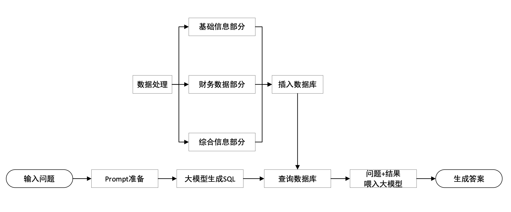


### 1. 馒头科技 

[[PPT]](./slides/馒头科技.pdf) [[视频]](https://www.bilibili.com/video/BV18h4y187UU/) [[代码]](./code/馒头科技)
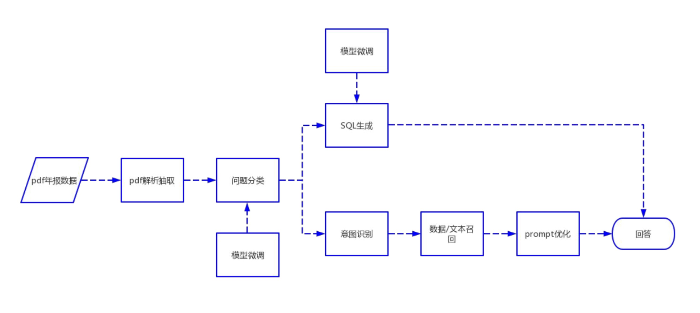
### 2. 南哪都队

[[PPT]](./slides/南哪都队.pdf) [[视频]](https://www.bilibili.com/video/BV1Gm4y1V7LD/) [[代码]](./code/南哪都队)

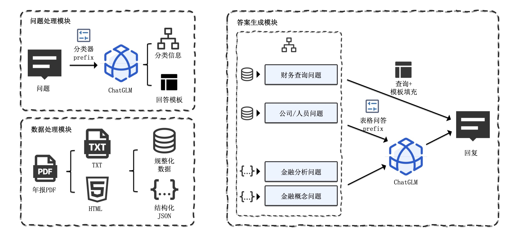

### 3. Chatglm反卷总局

[[PPT]](./slides/ChatGLM反卷总局.pdf) [[视频]](https://www.bilibili.com/video/BV1hu4y147EW/) [[代码]](./code/Chatglm反卷总局)

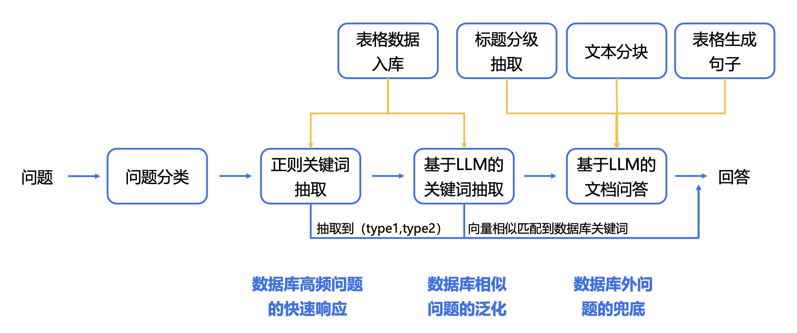

### 4. nsddd 

[[PPT]](./slides/nsddd.pdf) [[视频]](https://www.bilibili.com/video/BV15u4y147Xx) [[代码]](./code/nsddd)

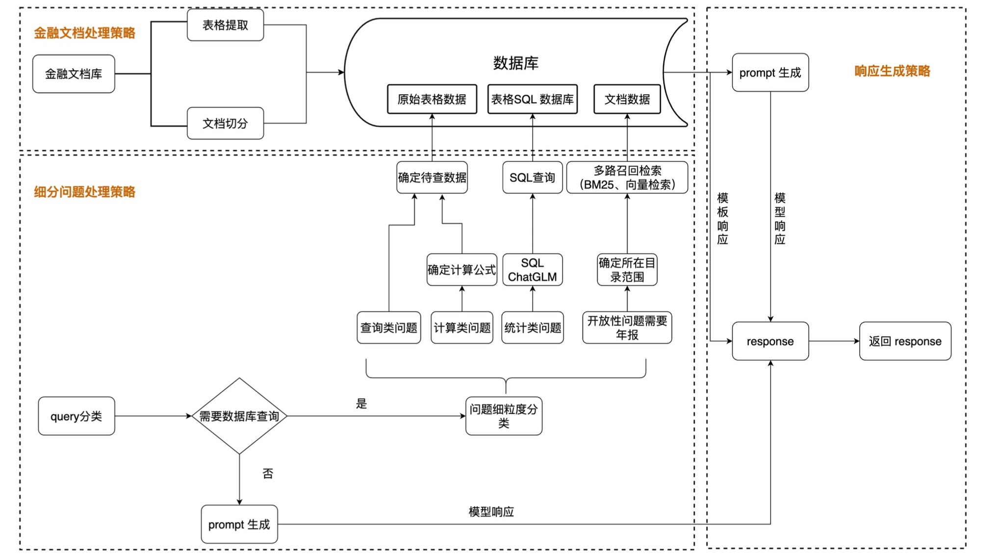


### 5. 龙盈战队 

[[PPT]](./slides/龙盈战队.pdf) [[视频]](https://www.bilibili.com/video/BV1Ju4y167ew) [[代码]](./code/龙盈战队)

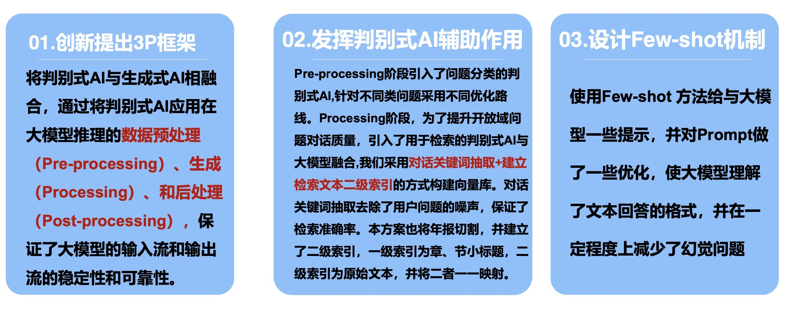
### 6. 结婚买房代代韭菜 

[[PPT]](./slides/结婚买房代代韭菜.pdf) [[视频]](https://www.bilibili.com/video/BV1rm4y1G7uj) [[代码]](./code/结婚买房代代韭菜)

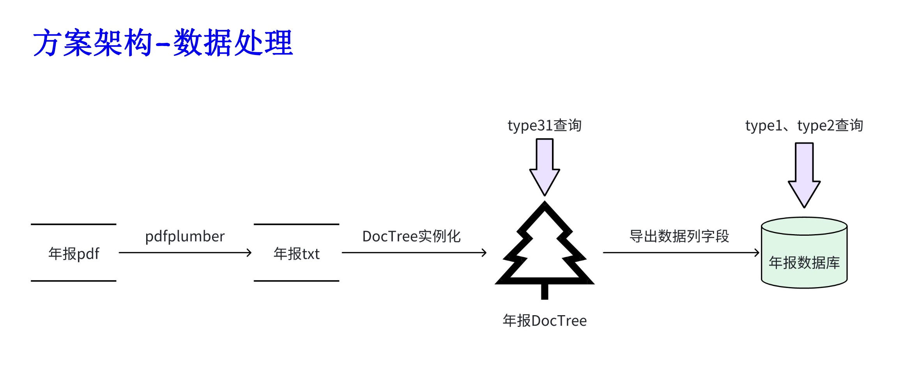
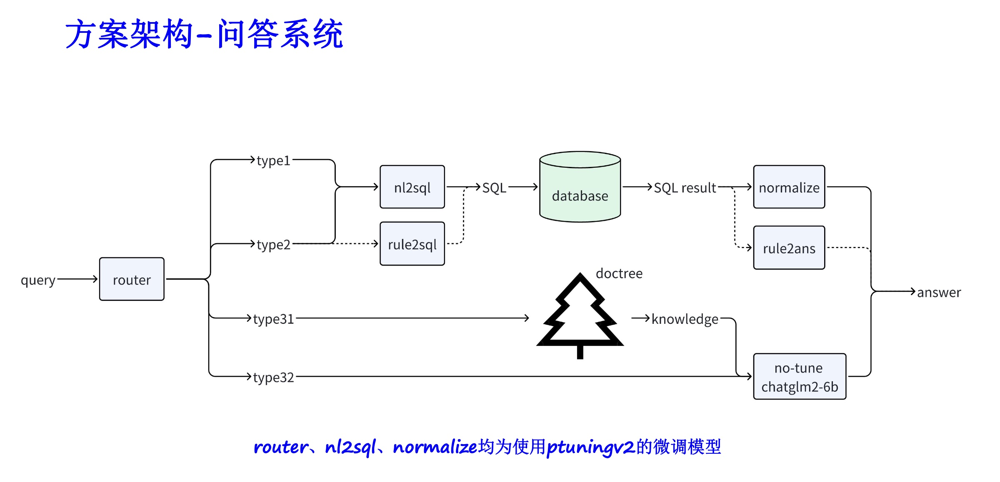

### 7. TabIsabaopilong 

[[PPT]](./slides/TabIsabaopilong.pdf) [[视频]](https://www.bilibili.com/video/BV1894y1a7NJ/) [代码]

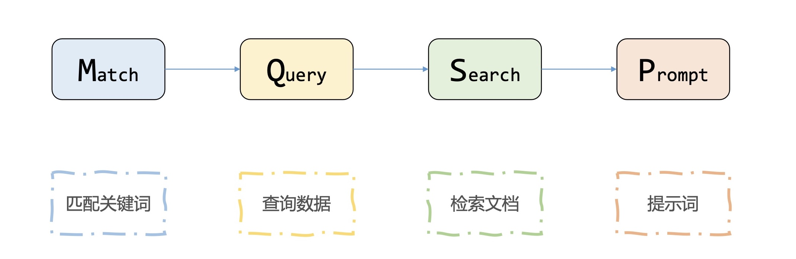
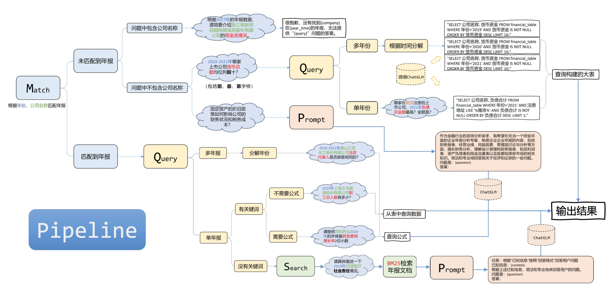

### 8. 饺子研究院 

[[PPT]](./slides/吃辣子.pdf) [[视频]](https://www.bilibili.com/video/BV12z4y1V7S3/?spm_id_from=333.999.0.0&vd_source=df16438efe36af5724526b8869fb54c1) [代码]

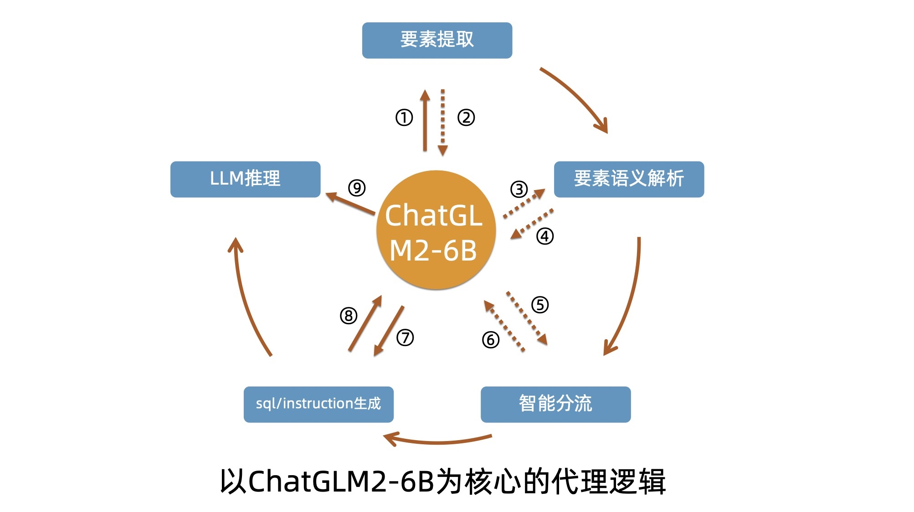


### 9. 流宝真人 

[[PPT]](./slides/流宝真人.pdf) [[视频]](https://www.bilibili.com/video/BV1QF411m7ap) [代码]

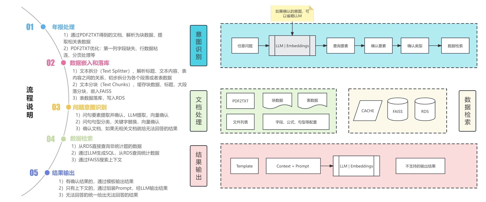


### 10. 随便取个名 
[PPT] [视频][[代码]](./code/随便取个名)

 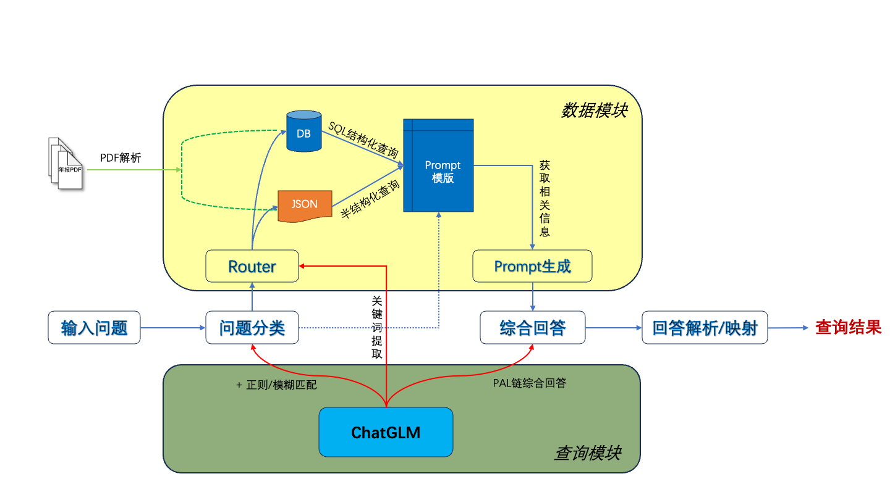

-------


## 📚 数据集

### 1. 年报数据集

我们开源的数据集涵盖了2019-2021年期间部分上市公司的年度报告。该数据集共包含 11588 个详尽的 PDF 文件（[list](./data/reports/reports_list.csv)）。您可以利用这些PDF文件的内容来构建您需要的数据库或者向量库。为了避免计算资源浪费，我们也将相应的文件转换成 TXT文件和 HTML文件，供大家使用。

#### [PDF下载](https://modelscope.cn/datasets/modelscope/chatglm_llm_fintech_raw_dataset/summary)

> 大小：69GB
> 文件格式：pdf文件
> 文件数量：11588

git加载
```
# 要求安装 git lfs
git clone http://www.modelscope.cn/datasets/modelscope/chatglm_llm_fintech_raw_dataset.git
```

sdk加载

```
# Note: 
# 1. 【重要】请将modelscope sdk升级到v1.7.2rc0，执行： pip3 install "modelscope==1.7.2rc0" -f https://modelscope.oss-cn-beijing.aliyuncs.com/releases/repo.html
# 2. 【重要】datasets版本限制为 >=2.8.0, <=2.13.0，可执行： pip3 install datasets==2.13.0

from modelscope.msdatasets import MsDataset

# 使用流式方式加载「推荐」
# 无需全量加载到cache，随下随处理
# 其中，通过设置 stream_batch_size 可以使用batch的方式加载

ds = MsDataset.load('chatglm_llm_fintech_raw_dataset', split='train', use_streaming=True, stream_batch_size=1)
for item in ds:
    print(item)

# 加载结果示例（单条，pdf:FILE字段值为该pdf文件本地缓存路径，文件名做了SHA转码，可以直接打开） 
{'name': ['2020-03-24__北京鼎汉技术集团股份有限公司__300011__鼎汉技术__2019年__年度报告.pdf'], 'pdf:FILE': ['~/.cache/modelscope/hub/datasets/modelscope/chatglm_llm_fintech_raw_dataset/master/data_files/430da7c46fb80d4d095a57b4fb223258ffa1afe8bf53d0484e3f2650f5904b5c']}


# 备注: 
1. 自定义缓存路径，可以自行设置cache_dir参数，即 MsDataset.load(..., cache_dir='/to/your/path')
2. 补充数据加载（从9493条增加到11588条），sdk加载注意事项
    a) 删除缓存中的csv映射文件(默认路径为)： ~/.cache/modelscope/hub/datasets/modelscope/chatglm_llm_fintech_raw_dataset/master/data_files/732dc4f3b18fc52380371636931af4c8
    b) 使用MsDataset.load(...) 加载，默认会reuse已下载过的文件，不会重复下载。

```


#### [TXT下载](https://modelscope.cn/datasets/modelscope/chatglm_llm_fintech_raw_dataset/summary)

Note: pdf转txt格式文件，方便大家复用（有个文件损坏了，所以总数比pdf少1个，共11587 个）

```
# Linux
wget https://sail-moe.oss-cn-hangzhou.aliyuncs.com/open_data/hackathon_chatglm_fintech/alltxt.zip

# Windows示例
Invoke-WebRequest -Uri https://sail-moe.oss-cn-hangzhou.aliyuncs.com/open_data/hackathon_chatglm_fintech/alltxt.zip -OutFile D:\\alltxt.zip
```


#### HTML下载

Note: pdf转html格式文件，方便大家复用（有个文件损坏了，所以总数比pdf少，共11582 个）
```
# Linux
wget https://sail-moe.oss-cn-hangzhou.aliyuncs.com/open_data/hackathon_chatglm_fintech/allhtml.zip

# Windows示例
Invoke-WebRequest -Uri https://sail-moe.oss-cn-hangzhou.aliyuncs.com/open_data/hackathon_chatglm_fintech/allhtml.zip -OutFile D:\\allhtml.zip
```


#### 使用建议

以下是我们推荐的处理步骤：

1、PDF文本和表格提取：您可以使用如pdfplumber、pdfminer等工具包提取PDF文件中的文本和表格数据。

2、数据切分：根据PDF文件的目录、子目录和章节信息，对内容进行精确的切块处理。

3、构建基础金融数据库：依据金融知识和PDF内容，设计专业的金融数据库字段和格式。例如，定义资产负债表、现金流量表和利润表等。

4、信息提取：使用大模型的信息提取能力和NLP技术来抽取对应的金融字段信息。例如，请使用json方式输出目录的内容，其中章节的名称作为key，页码作为value。同时，请详细地抽取表格内的数据，以JSON格式输出。

5、构建金融知识问答库：结合构建的金融数据库，应用大模型构建基础的金融问答库。例如，

```
{"question"："某公司2021年的财务费用为多少元？", "answer": "某公司2021年的财务费用为XXXX元。"}
prompt:用多种句式修改question及answer的内容。

{"question":"为什么财务费用可以是负的？", "answer": ""}
prompt：请模仿上面的question给出100个类似的问题与对应的答案，用json输出。
```

6、构建向量库：借助于如Word2Vec、Text2Vec等技术，从原始文本数据中提取出语义向量。使用pgvector这种基于PostgreSQL的扩展来存储和索引这些向量，从而建立起一个可供高效查询的大规模向量库。

7、应用：结合向量库、大模型、langchain等工具，提升应用效果。

### 2. 标注数据

在 [SMP 2023 ChatGLM 金融大模型挑战赛](https://tianchi.aliyun.com/competition/entrance/532126) 中我们分别进行了初赛、复赛A、复赛B、复赛C。针对这几轮比赛，我们分别人工标注了相关数据，累计总共有 10000 条。

* [[初赛数据]](./data/pre-data) ：5000 条
* [[复赛 A 数据]](./data/A-data) ：2000 条
* [[复赛 B 数据]](./data/B-data) ：2000 条
* [[复赛 C 数据]](./data/C-data) ：1000 条

数据示例：
```python
{"ID": 1,
"question": "2019年中国工商银行财务费用是多少元?",
"answer":"2019年中国工商银行财务费用是12345678.9元。"}

{"ID": 2,
"question": "工商银行2019年营业外支出和营业外收入分别是多少元?",
"answer": "工商银行2019年营业外支出为12345678.9元，营业外收入为2345678.9元。"}

{"ID":3,
"question": "中国工商银行2021年净利润增长率是多少?保留2位小数。",
"answer": "中国工商银行2020年净利润为12345678.90元，2021年净利润为22345678.90元，根据公式，净利润增长率=(净利润-上年净利润)/上年净利润，得出结果中国工商银行2021年净利润增长率81.00%。" }
```
与此同时，我们也针对比赛撰写了[评测代码](./data/evaluate.py)。我们依据：

```math

\begin{array}{ll}
max_{similar}(sentence1,sentence2,sentence3), & 无基础信息及关键词\\
0.25+0.25+max_{similar}(sentence1,sentence2,sentence3)*0.5, & 基础信息正确，关键词正确 \\
0.25 + 0 + max_{similar}(sentence1,sentence2,sentence3)*0.5, & 基础信息正确，关键词错误\\
0, & 基础信息错误

\end{array}

```


评测示例：

```python
{"question": "2019年中国工商银行财务费用是多少元?",

"prompt": {"财务费用": "12345678.9元", "key_word":"财务费用、2019", "prom_answer": "12345678.9元"},

"answer": [

"2019年中国工商银行财务费用是12345678.9元。",

"2019年工商银行财务费用是12345678.9元。",

"中国工商银行2019年的财务费用是12345678.9元。" ]

}
```
评测计算示例：

**答案一：工商银行2019年财务费用是12345678.9元。**

most similar sentences:

2019年工商银行财务费用是12345678.9元。 (Score: 0.9915)

中国工商银行2019年的财务费用是12345678.9元。 (Score: 0.9820)

2019年中国工商银行财务费用是12345678.9元。 (Score: 0.9720)

评分：0.25+0.25+0.9915*0.5=0.9958分。

> 评分解释：prom_answer正确、包含所有key_word、相似度最高0.9915。

**答案二：2019年中国工商银行财务费用是335768.91元。**

评分：0分。

> 评分解释：prom_answer错误不得分。

**答案三：12345678.9元。**

most similar sentences:

2019年工商银行财务费用是12345678.9元。 (Score: 0.6488)

2019年中国工商银行财务费用是12345678.9元。 (Score: 0.6409)

中国工商银行2019年的财务费用是12345678.9元。 (Score: 0.6191)

评分：0.25+0+0.6488*0.5=0.5744分。

> 评分解释：prom_answer正确、未包含所有key_word、相似度最高0.6488。


## 📊 项目问答演示
```python
{"id": 0, "question": "2021年其他流动资产第12高的是哪家上市公司？", "answer": "2021年其他流动资产第12高的公司是苏美达股份有限公司。"}
{"id": 1, "question": "注册地址在重庆的上市公司中，2021年营业收入大于5亿的有多少家？", "answer": "2021年注册在重庆，营业收入大于5亿的公司一共有4家。"}
{"id": 2, "question": "广东华特气体股份有限公司2021年的职工总人数为？", "answer": "2021年广东华特气体股份有限公司职工总人数是1044人。"}
{"id": 3, "question": "在保留两位小数的情况下，请计算出金钼股份2019年的流动负债比率", "answer": "2019金钼股份流动负债比率是61.10%。其中流动负债是1068418275.97元；总负债是1748627619.69元；"}
{"id": 4, "question": "2019年负债总金额最高的上市公司为？", "answer": "2019年负债合计最高的是上海汽车集团股份有限公司。"}
{"id": 5, "question": "2019年总资产最高的前五家上市公司是哪些家？", "answer": "2019年资产总计最高前五家是上海汽车集团股份有限公司、中远海运控股股份有限公司、国投电力控股股份有限公司、华域汽车系统股份有限公司、广州汽车集团股份有限公司。"}
{"id": 6, "question": "2020年营业收入最高的3家并且曾经在宁波注册的上市公司是？金额是？", "answer": "注册在宁波，2020年营业收入最高的3家是宁波均胜电子股份有限公司营业收入47889837616.15元；宁波建工股份有限公司营业收入19796854240.57元；宁波继峰汽车零部件股份有限公司营业收入15732749552.37元。"}
{"id": 7, "question": "注册地址在苏州的上市公司中，2020年利润总额大于5亿的有多少家？", "answer": "2020年注册在苏州，利润总额大于5亿的公司一共有2家。"}
{"id": 8, "question": "浙江运达风电股份有限公司在2019年的时候应收款项融资是多少元？", "answer": "2019年浙江运达风电股份有限公司应收款项融资是51086824.07元。"}
{"id": 9, "question": "神驰机电股份有限公司2020年的注册地址为？", "answer": "2020年神驰机电股份有限公司注册地址是重庆市北碚区童家溪镇同兴北路200号。"}
{"id": 10, "question": "2019年山东惠发食品股份有限公司营业外支出和营业外收入分别是多少元？", "answer": "2019年山东惠发食品股份有限公司营业外收入是1018122.97元；营业外支出是2513885.46元。"}
{"id": 11, "question": "福建广生堂药业股份有限公司2020年年报中提及的财务费用增长率具体是什么？", "answer": "2020福建广生堂药业股份有限公司财务费用增长率是34.33%。其中，财务费用是7766850.48元；上年财务费用是5781839.51元。"}
{"id": 12, "question": "华灿光电股份有限公司2021年的法定代表人与上年相比相同吗？", "answer": "不相同，华灿光电股份有限公司2020年法定代表人是俞信华，2021年法定代表人是郭瑾。"}
{"id": 13, "question": "请具体描述一下2020年仲景食品控股股东是否发生变更。", "answer": "2020年，仲景食品控股股东没有发生变更。"}
{"id": 14, "question": "什么是其他债权投资？", "answer": "其他债权投资是指企业或机构投资者通过购买债券、贷款、定期存款等金融产品获得的固定收益。这些金融产品通常由政府、公司或其他机构发行，具有一定的信用等级和风险。\n\n其他债权投资是企业或机构投资组合中的一部分，通常用于稳定收益和分散风险。与股票投资相比，其他债权投资的风险较低，但收益也相对较低。\n\n其他债权投资的管理和投资策略与其他资产类别类似，包括分散投资、风险控制、收益最大化等。然而，由于其他债权投资的种类繁多，其投资和管理也存在一定的特殊性。"}
```


## 课程

### GLM的使用教程

#### 1. 一代 ChatGLM-6B

[[PPT]](./slides/chatglm-6B.pdf) [[视频]](https://www.bilibili.com/video/BV1fd4y1Z7Y5)[技术文档]

#### 2. 二代模型：ChatGLM2-6B

[[PPT]](./slides/chatglm2-6b.pdf) [[视频]](https://www.bilibili.com/video/BV1D94y1i7Qp)[技术文档]

#### 3. 三代模型：ChatGLM3-6B

[[PPT]](./slides/chatglm3-6b.pdf) [[视频]](https://www.bilibili.com/video/BV1uC4y1J7yA)[[技术文档]](https://lslfd0slxc.feishu.cn/wiki/WvQbwIJ9tiPAxGk8ywDck6yfnof)


## 🤝 贡献者
以下是为本项目做出贡献的团队和个人：

- 🌟 安硕硕眼探企
- 🌟 馒头科技
- 🌟 南哪都队
- 🌟 Chatglm反卷总局
- 🌟 nsddd
- 🌟 龙盈战队
- 🌟 结婚买房代代韭菜
- 🌟 小打小闹
- 🌟 东北大土豆
- 🌟 随便取个名
- 🌟 ... 更多贡献者

FinGLM 开源项目出于完全公益目的，欢迎所有开发者申请加入，当然我们会进行严格审核。如有意向，请填写 [表单](https://lslfd0slxc.feishu.cn/share/base/form/shrcncipvYdAVitiTqNqxwIjglc) 。


## 免责声明

本项目相关资源仅供研究、交流使用，一般不建议用于商业用途；如用于商业用途，由此所带来的法律风险，请自行承担。

涉及到模型商业使用问题，请务必遵循相关模型的协议，例如 [ChatGLM-6B](https://github.com/THUDM/ChatGLM-6B)。


## 🔍 项目联系
### 项目交流群


### 开源赞助


### 开源贡献


## Star History

[](https://star-history.com/#MetaGLM/FinGLM&Date)

