# P-Tuning v2: 优化提示调整以提高金融领域大模型应用与优化

作者：馒头科技队 JamePeng

## 目标受众

希望面向自然语言处理（NLP）和机器学习领域的研究人员、学生以及对NLU模型调整和优化感兴趣的技术人员。

本教程暂时针对P-tuning V2进行深入探讨，后续可以追加其他微调教程

## 教程大纲

## 1. 介绍

### 1.1 引入提示调整（Prompt Tuning）概念及发展

[Prompt-tuning](https://aclanthology.org/2021.emnlp-main.243.pdf)（提示调整）是一种高效、低成本的方式，用于适应AI基础模型以执行新的下游任务，而无需重新训练模型和更新其权重。基础模型正迎来AI企业应用的下一个浪潮。这些大型、可重用的模型已经在互联网广泛的知识上进行了预训练，使它们更容易定制用于分析法律合同或检测金融文件中的合规性等任务。

<div align=center>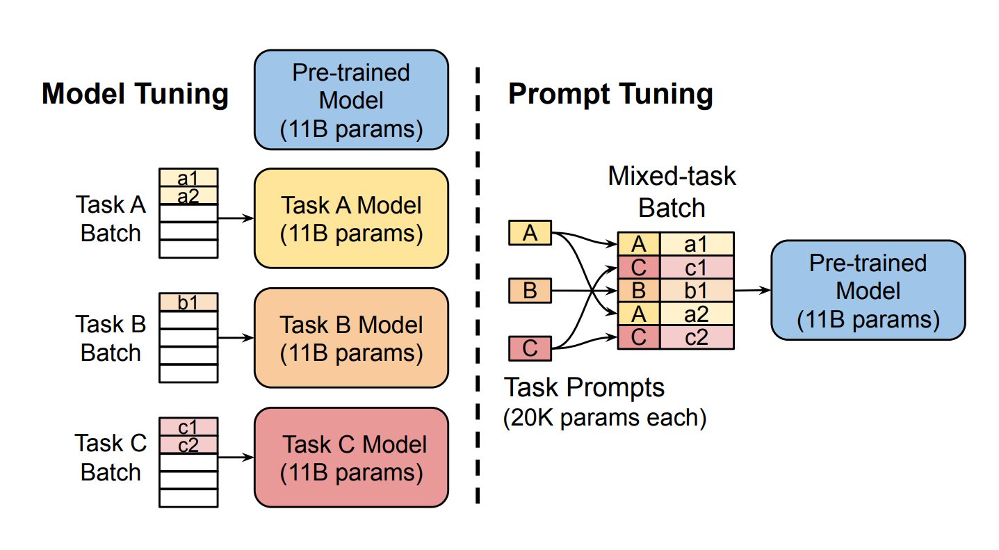</div>

在 Prompt-tuning（提示调整）中，最佳提示或前端提示被提供给您的AI模型，以为其提供特定任务的上下文。提示可以是由人工引入的额外词汇，也可以是引入模型嵌入层的AI生成的数字。就像填字游戏提示一样，这两种提示类型都引导模型朝着所需的决策或预测方向发展。提示调整允许具有有限数据的公司将大规模模型定制为狭窄任务。它还消除了更新模型的数十亿（或数万亿）权重或参数的需求。通过Prompt-tuning（提示调整），您可以迅速启动一个适用于特定需求的强大模型。它还可以让您更快速地进行实验。

斯坦福的研究人员引入了 [Prefix-tuning](https://aclanthology.org/2021.acl-long.353.pdf)（前缀调整）:
这是另一种自动提示设计方法，允许模型学习一个接一个地完成任务。prefix-tuning（前缀调整）将 soft prompts（软提示）与注入到深度学习模型的层中的提示相结合，以增加灵活性。虽然 Prompt-tuning（提示调整）更有效，但这两种技术都允许您冻结模型并跳过昂贵的重新训练。

<div align=center>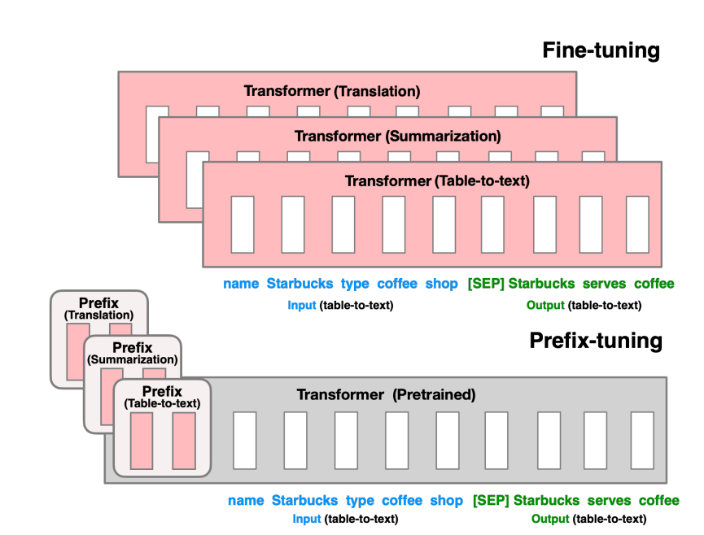</div>

在一篇标题为[《GPT Understands, Too》](https://arxiv.org/pdf/2103.10385.pdf)的论文中，来自清华大学、麻省理工、北京智源人工智能研究院、Recurrent AI 的 Xiao Liu、唐杰、杨植麟等研究者提出了一种名为 P-tuning 的新方法来自动搜索连续空间中的 prompt, P-tuning使用少量的连续自由参数作为提示，并将其作为输入传递给预训练语言模型，然后使用梯度下降来优化连续提示，而不是搜索离散提示，以提高 GPT 模型的自然语言理解能力。

<div align=center>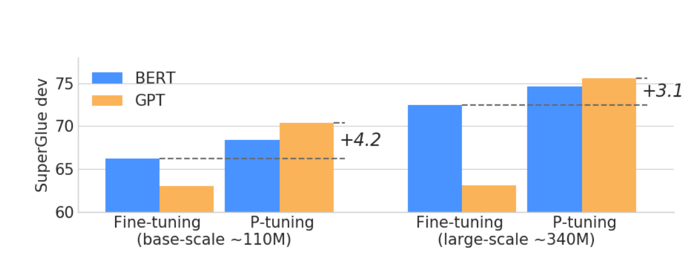</div>
实验结果表明，利用 P-tuning 方法，GPT 的自然语言能力可以匹敌 BERT。而且，P-tuning 还可以提高 BERT 在 few-shot 和监督场景下的性能。

---

### 1.2 解释P-Tuning v2的背景和动机

P-tuning v1有两个显著缺点：任务不通用和规模不通用

在一些复杂的自然语言理解NLU任务上效果很差，比如序列标注等；预训练模型的参数量不能小，仅在10B规模表现良好，而在稍小规模的模型（330M和2B）上表现不佳

<div align=center>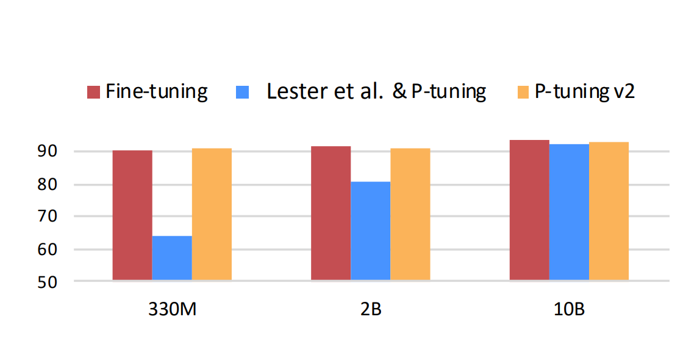</div>

P-Tuning v2并不是一个全新的方法，其事实上是将文本生成的prefix-tuning技术适配到NLU任务中，其主要结果如下：
- 仅精调0.1%参数量（固定LM参数），在330M到10B参数规模LM模型上，均取得和Fine-tuning相比肩的性能。而P-tuning v1仅在10B规模表现良好，而在稍小规模的模型（330M和2B）上表现不佳。
- 将Prompt tuning技术首次拓展至序列标注等复杂的NLU任务上，而P-tuning(v1)在此任务上无法运作。  

后面会对P-Tuning v2原理进行简单的开展

---

### 1.3 简要介绍目前微调的方法都有哪些？

随着大模型的参数日益增大，大到消费级计算硬件已经难以对大模型全部参数进行微调,每一次全参微调更新参数规模与预训练模型的大小一致，这对下游进行独立任务开发和部署微调模型变得越来越昂贵和艰难。  
参数高效微调方法（Parameter-Efficient Fine-Tuning，PEFT）方法被提出来解决这两个问题，PEFT 可以使 PLM 高效适应各种下游应用任务，而无需微调预训练模型的所有参数。 微调大规模 PLM 所需的资源成本通常高得令人望而却步。 在这方面，PEFT 方法仅微调少量或额外的模型参数，固定大部分预训练参数，大大降低了计算和存储成本，同时最先进的 PEFT 技术也能实现了与全量微调相当的性能

### 主流的方法有以下几种:  

#### 1、[LoRA（Low-Rank Adaptation of Large Language Models）](https://arxiv.org/pdf/2106.09685.pdf)  
直译为大语言模型的低阶自适应。LoRA 的基本原理是冻结预训练好的模型权重参数，在冻结原模型参数的情况下，通过往模型中加入额外的网络层，并只训练这些新增的网络层参数。由于这些新增参数数量较少，这样不仅 finetune 的成本显著下降，还能获得和全模型参数参与微调类似的效果。  

在大语言模型微调的过程中，LoRA 冻结了预先训练好的模型权重，并将可训练的秩的分解矩阵注入到 Transformer 体系结构的每一层。例如，对于预训练的权重矩阵$W0，可以让其更新受到用低秩分解表示后者的约束：

$W0+△W=W0+BA$  

其中:

$W0∈Rd×k,B∈Rd×r,A∈Rr×k$

而且，秩$r≪min(d,k)$,
此时，修正后的正向传播计算公式就变成：

$h=W0x+△Wx=W0x+BAx$

如下图所示，LoRA 微调时，对A使用随机高斯初始化，对B使用零初始化，因此$ΔW=BA$在训练开始时为零。
<div align=center>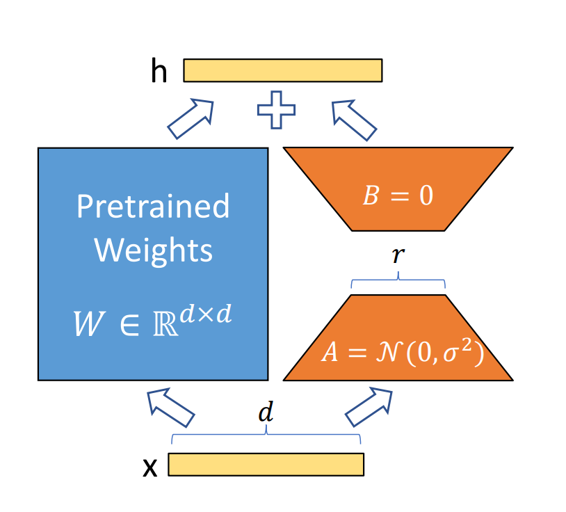</div>

在模型微调时，W0被冻结，不接受梯度更新，只微调参数A和B。与所有参数参与模型微调相比，此时该步骤模型微调的参数量由$d×k$变成$d×r+r×k$，而$r≪min(d,k)$，因此微调参数量大量减少了。

最终调整的参数量由  $△P = A*B$ 降低至 $△P = r*(A+B)$  
假设$ A=2048，B=1024，r=8 $  
$ 8*(2048+1024) / (2048*1024) == 24576/2097152 == 1.1\% $

可以看到通过LoRA微调方法大大减少调整一个大语言模型的参数量，也降低了模型的训练成本

### Chatglm的LoRA的使用教程可以参考：[LLM-Tuning](https://github.com/beyondguo/LLM-Tuning.git)

---

#### 2、[QLoRA(QLORA: Efficient Finetuning of Quantized LLMs)](https://arxiv.org/pdf/2305.14314.pdf)

该方法能够在仅使用一块48GB的GPU上微调一个具有650亿参数的模型，并且能够保持完整的16位微调任务性能。QLORA通过将梯度反向传播到一个已冻结的、4位量化的预训练语言模型，然后进一步传播到低秩适配器（LoRA）。研究人员提出的最佳模型系列被命名为"Guanaco"，在Vicuna基准测试中表现优于先前公开发布的所有模型，达到了ChatGPT性能水平的99.3%，而仅需要一块GPU上的24小时微调时间。

<div align=center>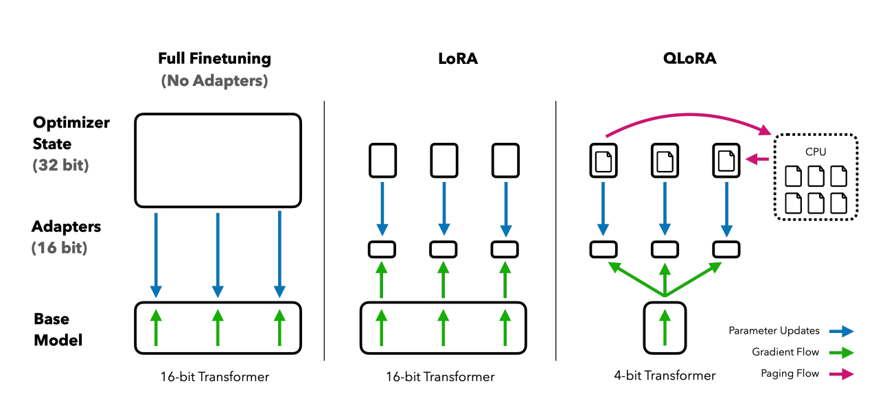</div>

QLORA引入了一些创新来节省内存，而不损害性能，包括：

- 4-bit NormalFloat (NF4)，这是一种对于正态分布权重来说信息理论上最优的数据类型；

- Double Quantization(双重量化)，通过对量化常数再次量化来减少平均内存占用；

- Paged Optimizers(分页优化器)，使用NVIDIA统一内存功能，自动进行CPU和GPU之间的页面传输，以确保在GPU内存不足时，GPU处理不会出现错误。这一功能类似于CPU RAM和磁盘之间的常规内存分页。Paged Optimizers用于为优化器状态分配页面内存，当GPU内存不足时，这些状态会自动转移到CPU RAM，并在优化器更新步骤中重新分页到GPU内存中。

### Chatglm的QLoRA的使用教程可以参考：[chatGLM-6B-QLoRA](https://github.com/shuxueslpi/chatGLM-6B-QLoRA.git)

---

#### 3、[P-tuning V2](https://arxiv.org/pdf/2110.07602.pdf)

P-Tuning v2 旨在解决微调（fine-tuning）方法中的两个问题：参数效率和弱泛化性能。

具体来说，P-Tuning v2 采用了一种参数高效的提示调整策略，用于文本检索任务，包括领域内、跨领域和跨主题的情况。通过广泛的分析，研究表明这种策略可以缓解微调方法所面临的两个问题：

- 参数效率问题：P-Tuning v2 仅更新了模型参数的极小部分（仅0.1%的参数），而不是像传统的微调方法一样更新全部参数。尽管仅更新了极小部分参数，但它可以显著提高检索模型的泛化性能；

- 弱泛化性能问题：P-Tuning v2 能够显著提高检索模型在领域外（out-of-domain）的零样本泛化性能，这意味着它可以更好地适应不同领域或主题的检索任务，而不仅仅局限于在训练时使用的领域或主题。

接下来会对P-Tuning v2原理进行简单的开展

---

### 2. P-Tuning v2的原理

在这一部分，我们将深入探讨P-Tuning v2的关键技术细节，包括连续提示的使用和模型层次的优化，以及它们如何影响性能和参数效率。

<div align=center>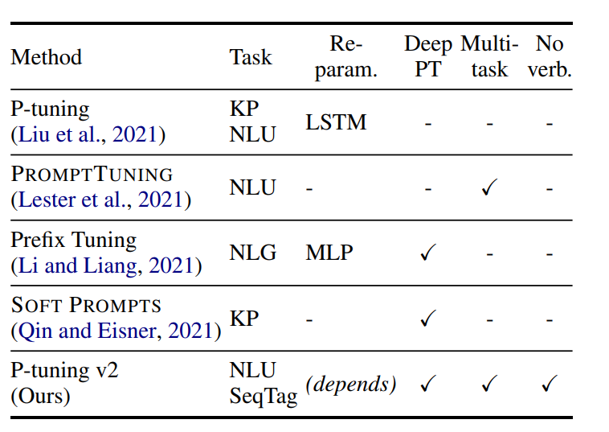</div>

### 2.1 连续提示的使用

P-Tuning v2的核心思想之一是引入连续提示（continuous prompts）来提高模型性能。连续提示是一种连续的输入，与传统的离散标记不同，它们可以灵活地插入到输入数据中，并且在训练期间只有提示的参数被更新。以下是连续提示的使用方式以及其重要性：

- 灵活插入：连续提示可以以灵活的方式插入到输入数据中，与输入标记一起传递给模型。这为模型提供了额外的任务相关信息，而不需要微调整个模型。

- 参数效率：由于只有连续提示的参数会在训练过程中更新，因此P-Tuning v2实现了更高的参数效率。这意味着只有一小部分参数需要调整，从而降低了存储和计算成本。

- 任务通用性：连续提示的设计使P-Tuning v2适用于各种NLU任务，不论是文本分类还是序列标记。这使得它成为一种通用的方法，可以在不同任务上表现出色。

### 2.2 模型层次的优化

P-Tuning v2的另一个关键创新是模型层次的优化。与之前的提示调整方法不同，P-Tuning v2将连续提示应用于模型的每个层次，而不仅仅是输入层。这种模型层次的优化带来了以下优势：

- 增加任务特定容量：通过在每个模型层次上应用连续提示，P-Tuning v2增加了模型的容量，使其能够更好地适应各种任务。这对于小型模型和难度较大的任务尤其有效，因为它可以更好地捕获任务相关的信息。

- 参数效率：尽管模型的容量增加，但只有连续提示的参数会被更新，从而保持了参数效率。这使得P-Tuning v2能够在更大的规模上工作而不会增加过多的计算和存储开销。

- 直接影响：连续提示添加到深层对模型预测的影响更为直接，这有助于提高模型在任务上的性能。这些深层提示可以更好地捕获输入数据的语义信息。

P-Tuning v2的工作原理可以概括为使用连续提示来引导模型学习任务特定信息，并通过在模型的每个层次上应用这些提示来增加模型的容量。这两个关键方面相互协作，使P-Tuning v2成为一种通用的、参数效率高的NLU模型优化方法。

---

### 3. P-Tuning v2的技术细节

<div align=center>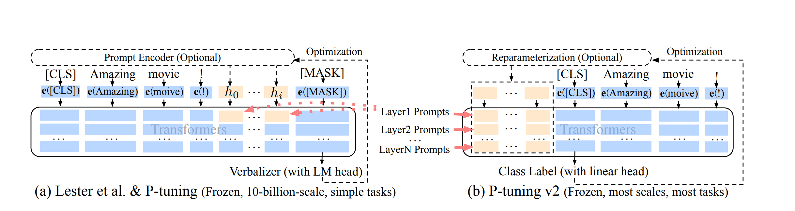</div>

P-Tuning v2的优化和实现细节，这些细节对于获得最佳性能非常重要。这些细节包括：

- 重新参数化（Reparameterization）：使用重新参数化编码器（如MLP）的效果在不同任务和数据集上有所不同。在某些数据集上，MLP带来了一致的性能提升，而在其他数据集上，它对结果几乎没有影响甚至可能产生负面效果。

- 提示长度（Prompt Length）：提示长度在P-Tuning v2中起着关键作用。不同的NLU任务通常需要不同长度的提示。一般来说，简单的分类任务更适合较短的提示（小于20个标记），而难度较大的序列标记任务更适合较长的提示（约100个标记）。如本次比赛的项目NL2SQL从200个标记就能有良好的表现。

- 多任务学习（Multi-task Learning）：P-Tuning v2支持多任务学习，这意味着模型可以在多个任务上进行联合训练，并共享连续提示。这有助于提高性能，特别是通过提供更好的初始化。如本次比赛中，问题分类、关键词提取和NL2SQL的三个微调任务可以联合训练获得不错的效果。

- 分类头部（Classification Head）：与先前的提示调整方法不同，P-Tuning v2不使用语言模型头部（LM head）来预测标签。而是在标记之上应用一个随机初始化的分类头部，类似于BERT模型。这种方法在全数据设置中效果显著，并且与序列标记任务兼容。  
  
---

### 4. 模型微调数据准备

在本次SMP 2023 ChatGLM金融大模型挑战赛中，要求参赛选手以ChatGLM2-6B模型为中心制作一个问答系统，回答用户的金融相关的问题。
那么，对用户问题的流程化处理过程就产生了不同的任务Task(Mission)

- 任务一：问题的分类(Classify)，如何让大模型知道该如何处理这类问题？
- 任务二：问题的关键词(Keywords)，如何让大模型准确获取问题点来回答问题？
- 任务三：如何高效地使用自然语言(NL2SQL)或者语义检索(Search)来让大模型获取财报数据进行处理？
- 任务四：根据数据汇总的结果(Conclusion)，让大模型用自然语言来回答用户的金融相关问题

语言大模型本身对任务四的处理能力已经表现的很好，对问题表述有一定的分类能力，关键词的提取相对比较合格，NL2SQL取决于其原始预训练集是否有针对性训练。

为了让语言大模型能够稳定准确地完成不同的任务，根据目标任务的情况针对性对其进行微调训练，强化语言大模型应对不同任务的处理能力。

---

### 4.1 根据不同的任务Task(Mission)构建不同的模板Pattern(Template)

从[Instruction Tuning](https://arxiv.org/pdf/2109.01652.pdf)这篇论文我们了解到，对于无模板设置，我们在 zero-shot 推理期间使用FLAN指令(因为如果我们不使用模板，模型将不知道执行什么任务)。对于只在数据集名称进行微调，我们报告了使用 FLAN instruction 和 使用数据集名称的 zero-shot 性能。这两种消融设置的表现都远低于 FLAN，意味着在训练时使用指令对在未见任务上的 zero-shot 性能是很重要的。

<div align=center>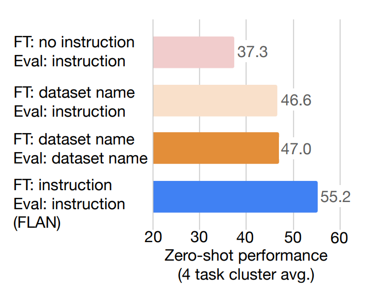</div>

针对不同的自然语言处理（NLP）任务，构建不同的模板或模式是一种有效的方法，可以有效激发和提升大模型对特定任务的处理性能。

---

#### 一、问题分类任务

问题分类任务通常涉及将文本分类到不同的预定义类别中。可以采取以下步骤构建相应的问题模板：

- 定义类别：首先，明确定义任务中的类别。这些类别根据任务问题情况进行设计。以下是根据这次比赛设计的分类

<div align=center>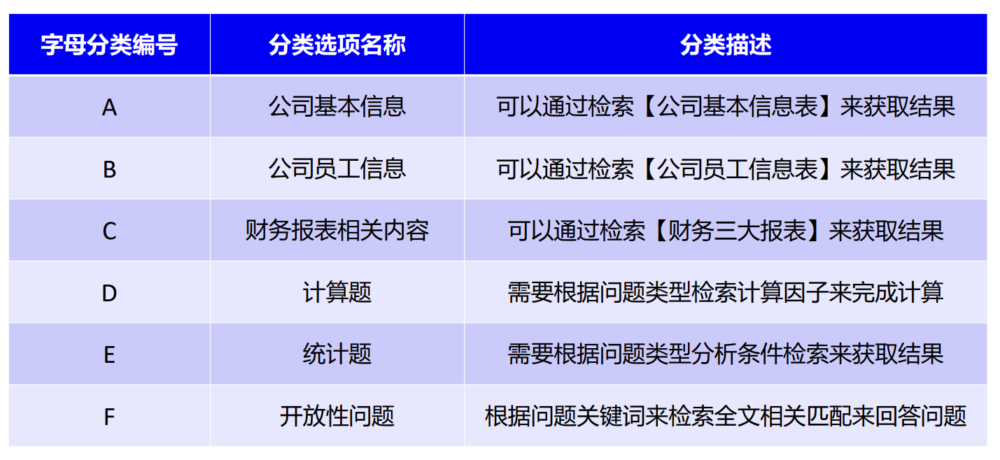</div>

- 问题选项强化描述，增强AI对问题选项的理解，如加入分类的描述，分类相关的关键词等

```python
  def _get_classify_prompt(self, question) -> str:
        classify_prompt = '''
        请问“{}”是属于下面哪个类别的问题?
        A: 公司基本信息,包含股票简称, 公司名称, 外文名称, 法定代表人, 注册地址, 办公地址, 公司网址网站, 电子信箱等.
        B: 公司员工信息,包含员工人数, 员工专业, 员工类别, 员工教育程度等.
        C: 财务报表相关内容, 包含资产负债表, 现金流量表, 利润表 中存在的字段, 包括费用, 资产，金额，收入等.
        D: 计算题,无法从年报中直接获得,需要根据计算公式获得, 包括增长率, 率, 比率, 比重, 占比等. 
        E: 统计题，需要从题目获取检索条件，在数据集/数据库中进行检索、过滤、排序后获得结果.        
        F: 开放性问题,包括介绍情况,介绍方法,分析情况,分析影响,什么是XXX.
        你只需要回答字母编号, 不要回答字母编号及选项文本外的其他内容.
        '''.format(question)
        return classify_prompt
```

- 构建模板：根据问题集的问题遍历提取用户提问，为每个类别构建一个模板或规则集，以便根据问题文本分类到正确的类别中。

<br/>

---

#### 二、关键词提取任务

关键词提取任务涉及从文本中提取关键词或短语，有助于后面检索相关信息，越精准的提取越能够让返回的信息更加准确。以下是构建关键词提取模板的步骤：

- 构建关键词提取的prompt，需要不断尝试prompt对问题的处理和稳定性，非微调的情况下few-shot也能有合格的表现。以下是本次比赛中测试比较稳定的prompt。

```python
    role_prompt = '''
        请帮我从以下句子中提取关键词。这些关键词是句子中最重要、最能概括句子主题的词汇。通过这些关键词，你可以更好地理解句子的内容。你只需要回答文本中的关键词，不要回答其他内容.
        用户输入：
        '''
    question_prompt = role_prompt + question
```
  
- 示例文本：收集不同具有代表性的问题所包含所需关键词类型的示例文本。(非必要，小模型使用示例文本可能会影响关键词的提取)  

- 构建模板：根据问题集的问题遍历提取用户提问，构建训练集的prompt模板

<br/>

---

#### 三、NL2SQL任务

NL2SQL任务涉及将自然语言问题转化为SQL查询，以从数据库中检索信息。以下是构建NL2SQL模板的步骤：

- 定义查询类型：查询，排序，输出范围，计数，求和，单字段检索，多字段检索，多字段检索多字段，字段的过滤等SQL执行需求。

- 示例对话：催眠大语言模型进行Agent扮演Mysql数据库开发人员，通过自然语言问题和相应的SQL查询的【示例对话】提供指令的理解。

- 数据库字段：传入数据库表名，设计的字段，该数据库已经较好的清洗合并数据，同类型字段检索能有较好的性能。

- 生成SQL查询：根据SQL语法树，生成正确的的SQL执行语句。

- 参数替换：将自然语言问题中的参数（如列名、条件等）替换为存在库中的数据库元素。

```python
    role_prompt = '''
        你是一名Mysql数据库开发人员，你精通Mysql数据库的sql代码编写，你需要根据已知的表名、字段名和用户输入的问题编写sql代码
        已知表名：company_table
        已知字段名：[公司全称、年份、经营活动现金流入小计、公司的中文简称、固定资产...]
        注意对问题中的中文数字（xx亿、xx千万、xx万）进行阿拉伯数字转换，如：一个亿、一亿需转换为100000000，一千万需转换为10000000
        要求sql代码中的字段名必须是已知字段名，不得新增字段名
        示例模板：
        """
        用户输入：2019年哪家公司的负债合计最高？
        sql如下：
        ```sql 
        select 公司全称 from company_table order by 负债合计 and 负债合计 is not null desc limit 1```

        用户输入：在上海注册的上市公司中，2019年谁的负债合计最高？金额是？
        sql如下：
        ```sql 
        select 公司全称, 负债合计 from company_table where 注册地址 LIKE '%上海%' and 年份 = '2019' order by 负债合计 and 负债合计 is not null desc limit 1 ```
        """
        请根据以下用户输入，输出sql代码。
        用户输入：
        '''
    question_prompt = role_prompt + question
```

<br/>

---

### 4.2 微调所需的数据准备步骤，包括数据集的设计、生成、标注和检查

#### 1. 明确训练集的格式(json格式、jsonl格式等)

#### 2. 任务定义：
 明确定义您的微调任务，包括任务类型及目标（问题分类、关键词提取、NL2SQL）以及任务的输入和输出格式和对应的key字段。

本次比赛的训练集设计四个字段：id，question_prompt，question，query

    - id:  训练数据标识，可用于训练数据的跟踪，确保训练数据的唯一性，也可以用于数据集管理和维护，ID可以用于数据集管理和维护，包括数据的版本控制、更新和修改。当需要对数据集进行更新或纠正错误时，ID可以用作标识和追溯工具。
    - question_prompt: 训练使用的输入Key，包含了Role prompt 和 question 的 Instruction prompt
    - question: 该JSON包含了问题提示（question_prompt）和实际问题内容（question）。这种设计使问题的意义和任务的背景清晰明了，有助于标注人员理解问题并进行标注。
    - query:  训练使用的输出Key，标注符合任务需要的目标输出结果

问题分类例子：

```json
{
    "id": 367,
    "question_prompt": "\n        请问“贵州茅台酒股份有限公司2020年的利息支出是多少元？”是属于下面哪个类别的问题?\n        A: 公司基本信息,包含股票简称, 公司名称, 外文名称, 法定代表人, 注册地址, 办公地址, 公司网址网站, 电子信箱等.\n        B: 公司员工信息,包含员工人数, 员工专业, 员工类别, 员工教育程度等.\n        C: 财务报表相关内容, 包含资产负债表, 现金流量表, 利润表 中存在的字段, 包括费用, 资产，金额，收入等.\n        D: 计算题,无法从年报中直接获得,需要根据计算公式获得, 包括增长率, 率, 比率, 比重,占比等. \n        E: 统计题，需要从题目获取检索条件，在数据集/数据库中进行检索、过滤、排序后获得结果.        \n        F: 开放性问题,包括介绍情况,介绍方法,分析情况,分析影响,什么是XXX.\n        你只需要回答字母编号, 不要回答字母编号及选项文本外的其他内容.\n        ",
    "question": "贵州茅台酒股份有限公司2020年的利息支出是多少元？",
    "query": "C"
},
```

关键词提取例子：

```json
{
    "id": 367,
    "question_prompt": "\n        请帮我从以下句子中提取关键词。这些关键词是句子中最重要、最能概括句子主题的词汇。通过这些关键词,你可以更好地理解句子的内容。你只需要回答文本中的关键词,不要回答其他内容.\n        用户输入：\n        \"贵州茅台酒股份有限公司2020年的利息支出是多少元？\"",
    "question": "贵州茅台酒股份有限公司2020年的利息支出是多少元？",
    "query": "利息支出"
},
```

#### 3. 数据生成与收集：
本次比赛中test_questions.json为基础进行标注，再通过扩增同类问题不同描述方式，同类问题替换不同术语等模板，使用OpenAI的GPT4或Google的Bard进行训练集扩张。单项任务有200-500条训练数据能有不错的初步表现。

*切记：要根据实际的任务类型进行训练集的收集，避免非任务相关的训练集引入导致训练结果不稳定。比赛前期遇到的一些坑:  <br/>  

<div align=center>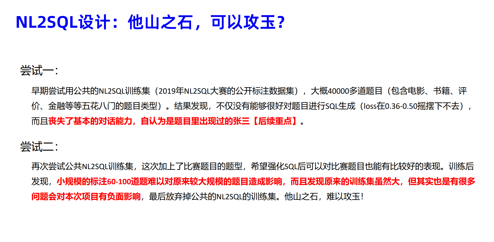</div>  

<br/>

#### 4. 数据集的标注

- 初始标注： 开始时，我们可以使用未训练的ChatGPT-2-6B模型进行少量标注，这些标注数据应包括各种问题类型，然后经过初步人工校验和修正，以得到第一次标注的小规模训练数据集。举例来说，我们可以首先标注大约100条具有代表性特征的数据。

- 第一次微调： 使用第一次标注的训练数据集来微调模型，生成初始的模型权重。接着，使用微调后的ChatGLM2-6B来标注一定规模的训练数据，再次经过人工校验和修正，以得到第二次标注的人工校验的训练数据集。举例来说，我们可以从最初的100条扩展到包含代表性的200-600条新的标注训练集。

- 第二次微调： 使用第二次标注的训练数据集进行模型的第二次微调，生成新的模型权重。接着，使用微调后的ChatGLM2-6B来标注一定规模的训练数据，再次经过人工校验和修正，以得到第三次标注的人工校验的训练数据集。举例来说，我们可以从最初的200-600条扩展到包含代表性的1000-3000条新的标注训练集。

- 重复迭代： 通过这种反复的人工标注和训练过程，我们从最初的小规模标注逐渐扩展到大规模的人工校对，这样可以减轻标注工作的难度，同时提高模型处理不同问题类型的准确性。

- 这一过程的关键在于逐步扩展、逐步评估和改进标注数据，以便更好地微调模型，让其适应更广泛的问题类型并提高性能。

#### 5. 数据分割

将数据集划分为(训练数据train.json、验证数据validation.json、测试数据test.json)。通常，70-80%的数据用于训练，10-15%用于验证，10-15%用于测试。可以看4.3 如何对数据集进行划分管理，以便评估性能 的章节描述

---

### 4.3 如何对数据集进行划分管理，以便评估性能

注：这里主要是对单一任务类型的数据集进行讲解，如问题分类、关键词提取、NL2SQL等某一项单一任务。

### 方案一: 标准数据集按比例划分

<div align=center>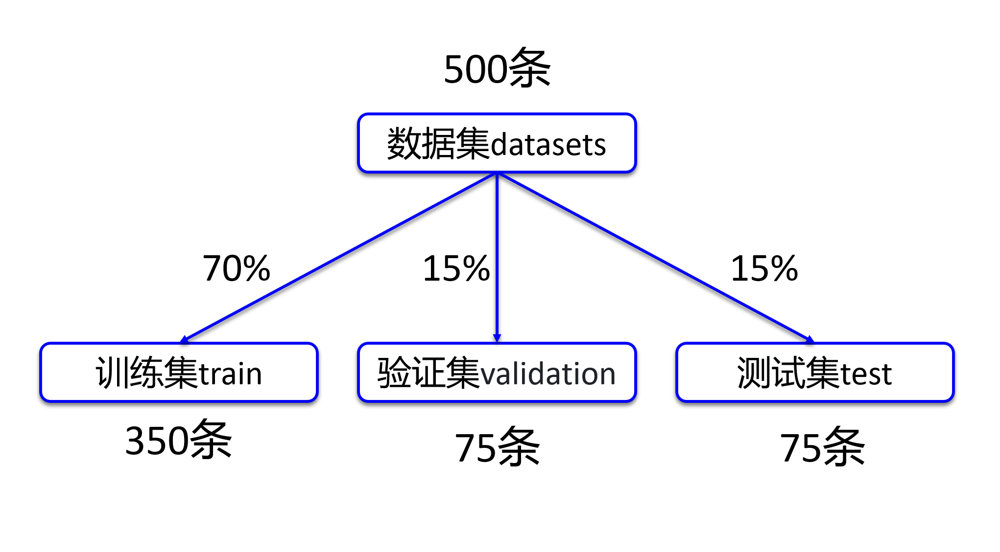</div>

(1)数据集

- 包括训练数据train.json、验证数据validation.json和测试数据test.json。
- 数据集通常位于不同的文件中或是不同的文件夹,根据项目代码设计。

(2)划分比例

- 根据任务类型及模板生成一个训练集文件。
- 通常使用百分比来划分数据，例如，70%的数据用于训练、15%用于验证、15%用于测试。

(3)目的

- 训练集用于训练模型的参数。
- 验证集用于调整模型的超参数，如学习率、批次大小等。
- 测试集用于最终评估模型性能。

### 方案二: 单一数据集

<div align=center>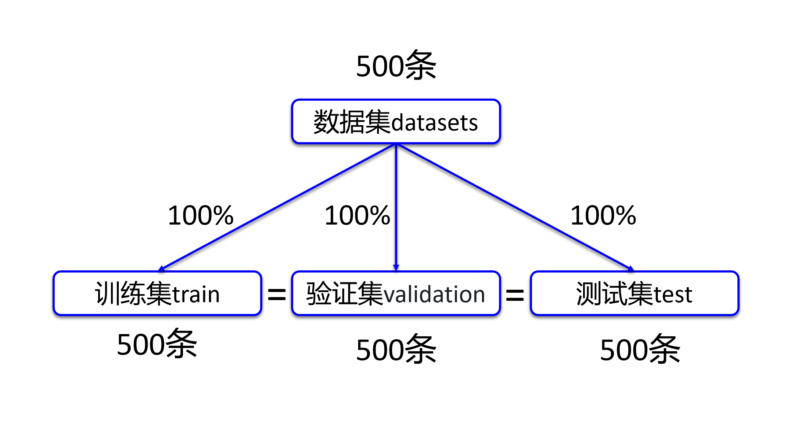</div>

(1)数据集

- 包括训练数据train.json、验证数据validation.json和测试数据test.json。
- 三个数据集为同一个数据集文件拷贝，包括所有训练数据。

(2)目的

- 用于验证微调前和微调后模型的输出是否稳定。
- 通过相同的数据集来测试对比两种模型微调前后的性能。

(3)缺陷

- 过度训练容易出现过拟合的现象，应用到各种变数的实际场景存在不稳定的表现。*可以通过强化训练集数据不同变种来抵抗不稳定的表现。

---

### 4.4 提供示例代码或工具，帮助学习者了解如何训练和部署数据，以供模型微调使用

项目使用Chatglm官方提供的P-Tuning v2训练代码：https://github.com/THUDM/ChatGLM2-6B/tree/main/ptuning

可参考该仓库的使用教程，主要修改 train.sh 和 evaluate.sh 中的 train_file、validation_file和test_file为你自己的 JSON 格式数据集路径，并将 prompt_column 和 response_column 改为 JSON 文件中输入文本和输出文本对应的 KEY。可能还需要增大 max_source_length 和 max_target_length 来匹配你自己的数据集中的最大输入输出长度。

接下来将讲解微调过程中的实践技巧和参数使用

---

### 5. 模型微调技巧和步骤

### 5.1 讨论模型P-Tuning v2微调的一般流程的实践

1. 配置好Chatglm2-6B和P-Tuning v2的环境依赖，在P-Tuning v2 代码目录下创建一个RawModels的文件夹，将Chatglm2-6B的模型下载到该目录下

2. 准备好训练集文件train.json和测试集dev.json, 在P-Tuning v2 代码目录下创建一个FinTrain的文件夹，将训练集文件放到该文件夹路径下

3. 配置train.sh文件，根据训练需要调整对应的参数，如模型路径，训练集路径，训练集字段，训练步数，输出路径等，可参考5.2的参数介绍进行设置。

4. 运行train.sh文件开始执行训练，等待step执行结束，期间观察loss的变化情况。

5. 配置evaluate.sh文件，根据训练需要调整对应的参数，如模型路径，微调权重路径，测试集路径，测试集字段，测试步数，输出路径等，可参考5.2的参数介绍进行设置。

6. 运行evaluate.sh文件，等待测试结果，完成后观察 Rouge score 和 BLEU-4的结果，评估微调工程是否符合设计。

7. 符合设计后，将模型和微调权重加载运行，测试实际任务中的表现情况，根据返回的结果重复调整优化训练集和微调训练。

<br/>

---

### 5.2 解释P-Tuning v2微调过程中的超参数选择，如学习率、批量大小、日志步骤、保存步骤等

接下来就针对train.sh、evaluate.sh 文件来解析他们超参数的作用：

### train.sh 参数介绍

|  参数名称  |  参数解释  |
|   ----    |   ----     |
| PRE_SEQ_LEN  | Shell变量，设置为训练集传入的prompt的长度 |
| LR  | Shell变量，设置为学习率P-Tuning v2默认2e-2，可以从1e-2开始往下进行尝试 |
| NUM_GPUS | Shell变量，用于训练的GPU数量 |
| RUNING_STEP | Shell变量，训练运行的步数 |
| CUDA_VISIBLE_DEVICES=1 | 在单机多卡的设备中，我们可以指定使用某几块GPU来运行，这里设置为只使用索引1的GPU，可以通过nvidia-smi查看GPU索引 |
| train_file | 训练数据的输入文件，可以是jsonlines或csv文件 |
| validation_file  | 用于评估指标（如ROUGE）的可选评估数据文件，可以是jsonlines或csv文件 |
| preprocessing_num_workers | 用于预处理的进程数 |
| prompt_column | (输入) 数据集中包含完整文本（用于摘要生成）的列的名称，即前面设计训练集的question_prompt |
| response_column | (输出) 数据集中包含摘要（用于摘要生成）的列的名称，即前面设计训练集的query |
| overwrite_cache | 是否覆盖缓存的训练和评估集 |
| model_name_or_path | 预训练模型的路径或标识符，可以是Hugging Face网站的标识符或本地路径。用于指定要微调的预训练模型 |
| output_dir | 输出目录，模型的预测结果和检查点将被保存在这个目录中 |
| overwrite_output_dir | 如果设置为True，将覆盖输出目录的内容。这可以用于继续训练，如果output_dir指向一个检查点目录的话 |
| max_source_length | (输入) 在标记化后的最大输入序列长度。超过此长度的序列将被截断，短于此长度的序列将被填充 |
| max_target_length | (输出) 目标文本的最大序列长度。超过此长度的序列将被截断，短于此长度的序列将被填充 |
| per_device_train_batch_size | 用于训练的每个GPU/XPU/TPU/MPS/NPU核心/CPU的批次大小，默认是1 |
| per_device_eval_batch_size | 用于评估的每个GPU/XPU/TPU/MPS/NPU核心/CPU的批次大小，默认是1 |
| gradient_accumulation_steps | 在执行反向传播和权重更新之前，累积梯度的步骤数。例如，如果设置为16，则每16个步骤执行一次梯度更新 |
| predict_with_generate | 默认为 False, 该参数用于控制是否使用生成（generate）来计算生成性指标（例如 ROUGE、BLEU）。当设置为 True 时，模型将生成文本并使用生成的文本进行指标评估。如果为 False，将使用其他方法进行评估 |
| max_steps | 如果设置为正数，将执行的总训练步数。它会覆盖num_train_epochs。如果使用有限可迭代的数据集，当所有数据耗尽时，训练可能会在达到设置的步数之前停止 |
| logging_steps | 它表示在每隔多少个更新步骤（training steps）后，会记录一次训练信息，包括损失值、指标等 |
| save_steps | 表示在两个检查点保存之间的更新步骤数，多少step保存一次 |
| learning_rate | 学习率控制了模型在每次权重更新时的调整幅度。较小的学习率可以使模型收敛得更慢但可能更稳定，而较大的学习率可以使模型收敛得更快但可能更不稳定。通常，1e-5和5e-5是一个常见的起始学习率。P-Tuning v2默认给了2e-2，这个其实有点不够用。可以从1e-2开始往下进行尝试 |
| pre_seq_len | 用于指定输入序列的预定义长度。这可以用于固定输入序列的长度。 |
| quantization_bit | 用于指定模型权重量化的位数，以减小模型大小并节约训练使用的显存 |
---

<br/>

### evaluate.sh 参数介绍

|  参数名称  |  参数解释  |
|   ----    |   ----     |
| PRE_SEQ_LEN  | Shell变量，设置为训练集传入的prompt的长度 |
| LR  | Shell变量，设置为P-Tuning v2默认学习率2e-2，可以从1e-2开始往下进行尝试，1e-5和5e-5是一个常见的起始学习率。|
| CHECKPOINT | Shell变量，微调文件的文件夹名称 |
| NUM_GPUS | Shell变量，用于训练的GPU数量 |
| STEP | Shell变量，评估运行的步数 |
| CUDA_VISIBLE_DEVICES=1 | 在单机多卡的设备中，我们可以指定使用某几块GPU来运行，这里设置为只使用索引1的GPU，可以通过nvidia-smi查看GPU索引 |
| test_file | 用于测试数据的输入文件，可以是jsonlines或csv文件 |
| validation_file  | 用于评估指标（如ROUGE）的可选评估数据文件，可以是jsonlines或csv文件 |
| do_eval  | 是否在验证集上运行评估 |
| do_predict | 是否在测试集上运行预测 |
| prompt_column | (输入) 数据集中包含完整文本（用于摘要生成）的列的名称，即前面设计训练集的question_prompt |
| response_column | (输出) 数据集中包含摘要（用于摘要生成）的列的名称，即前面设计训练集的query |
| overwrite_cache | 是否覆盖缓存的训练和评估集 |
| model_name_or_path | 预训练模型的路径或标识符，可以是Hugging Face网站的标识符或本地路径。用于指定要运行的预训练模型 |
| ptuning_checkpoint | p-tuning v2检查点的路径，用于特定的微调任务 |
| output_dir | 输出目录，模型的预测结果和检查点将被保存在这个目录中 |
| overwrite_output_dir | 如果设置为True，将覆盖输出目录的内容。这可以用于继续训练，如果output_dir指向一个检查点目录的话 |
| max_source_length | (输入) 在标记化后的最大输入序列长度。超过此长度的序列将被截断，短于此长度的序列将被填充 |
| max_target_length | (输出) 目标文本的最大序列长度。超过此长度的序列将被截断，短于此长度的序列将被填充 |
| per_device_eval_batch_size | 用于评估的每个GPU/XPU/TPU/MPS/NPU核心/CPU的批次大小，默认是1 |
| predict_with_generate | 默认为 False, 该参数用于控制是否使用生成（generate）来计算生成性指标（例如 ROUGE、BLEU）。当设置为 True 时，模型将生成文本并使用生成的文本进行指标评估。如果为 False，将使用其他方法进行评估 |
| pre_seq_len | 用于指定输入序列的预定义长度。这可以用于固定输入序列的长度。 |
---

<br/>

### 5.3 如何加载微调训练后的权重进行使用？

在我们完成模型的微调训练和评估测试后，开始部署微调权重，首先先定位找到我们训练好的模型权重，一般在你的train.sh设定输出的文件夹里面

<div align=center>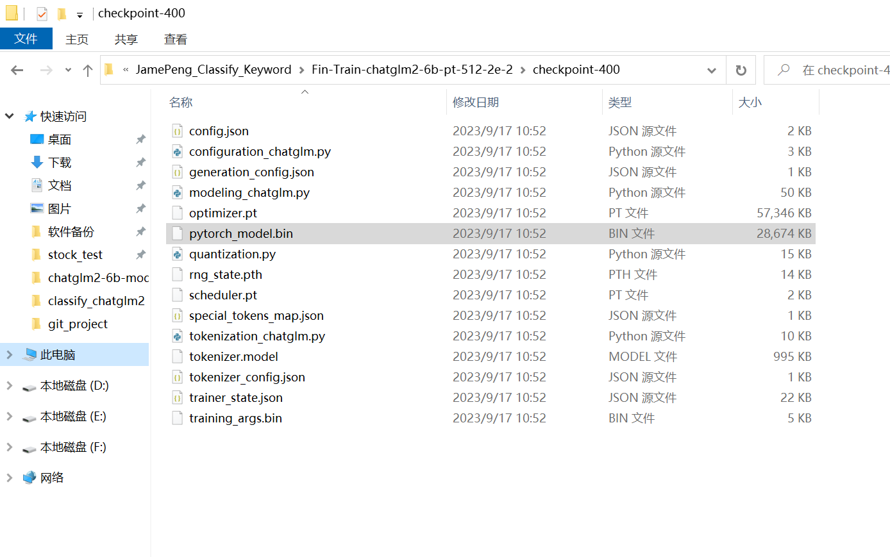</div>

找到带有这个pytorch_model.bin文件的文件夹，可以先定义一个变量CHECKPOINT_PATH保存该路径，当然使用config.py来配置路径可以更好管理所有的路径变量

*示例代码仅供演示参考，实际路径应该改为您设备上部署的【预训练】及【微调】的模型路径

```python
# 导入transformers库中的相关模块
from transformers import AutoConfig, AutoModel, AutoTokenizer

import torch  # 导入PyTorch库
import json  # 导入JSON库
import os  # 导入操作系统相关的库

# 指定微调权重的路径
CHECKPOINT_PATH = ("/home/jamepeng/git_projects/ChatGLM2-6B/ptuning_classify_keyword\output\JamePeng_Classify_Keyword\Fin-Train-chatglm2-6b-pt-512-2e-2\checkpoint-400")

# 指定预训练模型的路径
MODEL_PATH = "/home/jamepeng/git_projects/chatglm2-6b-model"

# 这里要匹配你训练时候设定的参数, 如这个分类和关键词合并的微调，当时我用512作为PRE_SEQ_LEN进行训练
PRE_SEQ_LEN = 512

# 从指定路径加载模型的Tokenizer
tokenizer = AutoTokenizer.from_pretrained(MODEL_PATH, trust_remote_code=True)

# 从指定路径加载模型的配置文件, 设定PRE_SEQ_LEN参数
config = AutoConfig.from_pretrained(MODEL_PATH, trust_remote_code=True, pre_seq_len=PRE_SEQ_LEN)

# 从指定路径加载预训练模型
model = AutoModel.from_pretrained(MODEL_PATH, config=config, trust_remote_code=True)

# 从指定微调权重的路径加载PyTorch模型的微调参数
prefix_state_dict = torch.load(os.path.join(CHECKPOINT_PATH, "pytorch_model.bin"))

# 提取与指定前缀匹配的模型参数
new_prefix_state_dict = {}
for k, v in prefix_state_dict.items():
    if k.startswith("transformer.prefix_encoder."):
        new_prefix_state_dict[k[len("transformer.prefix_encoder."):]] = v

# 将前缀编码器的参数加载到模型中
model.transformer.prefix_encoder.load_state_dict(new_prefix_state_dict)

# 将模型切换为半精度FP16浮点数并移至CUDA设备（GPU）
model = model.half().cuda()

# 如果之前定义的序列长度参数不是None，执行P-tuning v2操作
if pre_seq_len is not None:
    # P-tuning v2
    model.transformer.prefix_encoder.float()

# 设置模型为评估模式，不进行训练
model.eval()

```

这样ChatGLM2-6B模型就加载好了微调权重, 可以开始使用

---
<br/>

前提注意：本次演示使用的是关键词提取和问题分类合并后的微调权重（实际任务请根据实际需求设计）

为了方便使用，我们可以构建一个build_prompt的函数方便我们构建训练时使用的prompt_template使用:

通过传入任务类型type和问题文本question_text，返回对应任务构建的prompt_template

```python
def build_prompt(type, question_text):

    if "find_keywords" in type:
        prompt_keywords = '''
            请帮我从以下句子中提取关键词。这些关键词是句子中最重要、最能概括句子主题的词汇。通过这些关键词，你可以更好地理解句子的内容。你只需要回答文本中的关键词,不要回答其他内容.
            用户输入：
            '''
        question_prompt = f"{prompt_keywords} {question_text}"
        return question_prompt

    elif "classify_question" in type:
        prompt_classify_question = '''
            请问“{}”是属于下面哪个类别的问题?
            A: 公司基本信息,包含股票简称, 公司名称, 外文名称, 法定代表人, 注册地址, 办公地址, 公司网址网站, 电子信箱等.
            B: 公司员工信息,包含员工人数, 员工专业, 员工类别, 员工教育程度等.
            C: 财务报表相关内容, 包含资产负债表, 现金流量表, 利润表 中存在的字段, 包括费用, 资产，金额，收入等.
            D: 计算题,无法从年报中直接获得,需要根据计算公式获得, 包括增长率, 率, 比率, 比重,占比等. 
            E: 统计题，需要从题目获取检索条件，在数据集/数据库中进行检索、过滤、排序后获得结果.        
            F: 开放性问题,包括介绍情况,介绍方法,分析情况,分析影响,什么是XXX.
            你只需要回答字母编号, 不要回答字母编号及选项文本外的其他内容.
            '''.format(question_text)
        return prompt_classify_question
    return ""
```

---
<br/>

前提注意：本次演示使用的是关键词提取和问题分类合并后的微调权重（实际任务请根据实际需求设计）

本次比赛使用test_questions.json来提供输入，那么先判断是json还是jsonline，前者使用json读取即可，后者改用逐行读取

```python
question_process_list = []  # 创建一个空列表，用于处理结果的存储

# 打开名为test_questions.json的JSON文件以读取内容，并指定编码为utf-8
with open("./test_questions.json", 'r', encoding='utf-8') as tqfp:

    # 加载JSON文件中的数据到test_questions变量
    test_questions = json.load(tqfp)  

    # 遍历test_questions列表中的前1000个元素 (测试使用，实际根据自己任务需求修改)
    for id, test_question in enumerate(test_questions[:1000]):
        
        # 获取问题文本
        question = test_question['question']  

        # 构建一个提示，可能用于问题分类
        classify_question_prompt = build_prompt("classify_question", question)

        # 构建一个提示，可能用于提取关键词
        keywords_question_prompt = build_prompt("find_keywords", question) 
        
        # 使用模型生成一个问题分类回复
        classify_query, history = model.chat(tokenizer, classify_question_prompt, max_length=pre_seq_len, top_p=1, do_sample=False, temperature=0.001)

        # 使用模型生成一个关键词提取回复
        keywords_query, history = model.chat(tokenizer, keywords_question_prompt, max_length=pre_seq_len, top_p=1, do_sample=False, temperature=0.001)

         # 创建一个包含相关信息的字典
        result = {"id": id, "question": question, "classify_query": classify_query, "keywords_query": keywords_query}
       
        # 打印生成的数据（测试）
        print(result)  

        # 将生成的数据添加到question_process_list列表中
        question_process_list.append(result) 

    # 创建或打开一个名为question_process_list.json的文件以写入内容，指定编码为utf-8
    with open("question_process_list.json", 'w', encoding="utf-8") as td_fp:
        
        # 将question_process_list列表中的数据以JSON格式写入文件，不使用ASCII编码，缩进为2个空格
        json.dump(question_process_list, td_fp, ensure_ascii=False, indent=2)
```

---
<br/>

如果想卸载掉加载了权重的模型，可以使用以下方式释放：

```python
del model
del tokenizer
torch.cuda.empty_cache() # 释放显存
```

### 5.4 微调过程中的一些重要事项，以及如何解决常见问题

#### 一、构造训练集的注意事项

1. 数据准备： 确保训练集是高质量、多样化的。数据的质量对于模型的性能至关重要。

2. 数据清洗： 在将数据用于微调之前，可能需要进行数据清洗，包括去除噪声、错误标签或前后矛盾不一致的数据。6B模型的能力有限，尽可能把干扰项的格式和文本去除

3. 数据平衡： 确保正负样本的平衡性，特别是在二元分类问题中。不平衡的数据集可能导致模型性能下降。

4. 数据增强： 使用OpenAI的GPT4或GLM130B之类的大模型来增加训练数据的多样性，例如问题不同文案描述、使用不同的语气敬语、问题描述的语言组织先后顺序、不同金融名词的替换、一个问题使用不同数量的金融名词等。还可以一类问题扩增20-40条。这有助于模型泛化到不同类型的输入。

5. 样本选择： 根据任务类型，可以考虑在训练集中选择具有代表性的样本，以提高模型的性能。

#### 二、训练过程中的注意事项

1. 超参数调优： 仔细选择学习率、批量大小等超参数。
    - 使用学习率调度策略来帮助模型更好地收敛。P-Tuning v2默认学习率2e-2，可以从1e-2开始往下进行尝试，1e-5和5e-5是一个常见的起始学习率。
    - PRE_SEQ_LEN、max_source_length 这两个就注意要和训练集的max(question_prompt)传入吻合，设置过小会导致文本被截断，设置过大会让训练变得很长，尽量设计为8的倍数（128、256、512、1024、2048）.
    - max_target_length 设置为最佳的输出范围即可。如本次问题分类和关键词提取使用256就足够（根据实际任务需要设定）。
    - 在默认配置 quantization_bit=4、per_device_train_batch_size=1、gradient_accumulation_steps=16 下，INT4 的模型参数被冻结，一次训练迭代会以 1 的批处理大小进行 16 次累加的前后向传播，等效为 16 的总批处理大小，此时最低只需 6.7G 显存。不使用quantization_bit=4参数的话，大概是15.7G 显存。若想在同等批处理大小下提升训练效率，可在二者乘积不变的情况下，加大 per_device_train_batch_size 的值，但也会带来更多的显存消耗，请根据实际情况酌情调整。

2. 监控训练： 定期记录训练过程中的指标，如损失、准确率、精确度和召回率。这有助于检测潜在问题并及时采取措施。
    - 比如训练过程中出现某个loss会突然调高，可能是训练集里面存在矛盾的标注（错误的标注）、存在同类问题不同标注方式（任务类型里类似关键词提取是最容易受到影响）
    - 300 step以内loss很难降到理想的数值（本次比赛我就设定了0.02以下的loss目标）。需要检查训练集里面大概率存在一定量的错误标注，可以使用训练出来的微调权重跑一下evaluate看看结果generated_predictions.txt的输出，看看哪些出现不稳定的情况。
    - 可以使用matplotlib将训练日志trainer_state.json的loss进行输出打印
        <div align=center>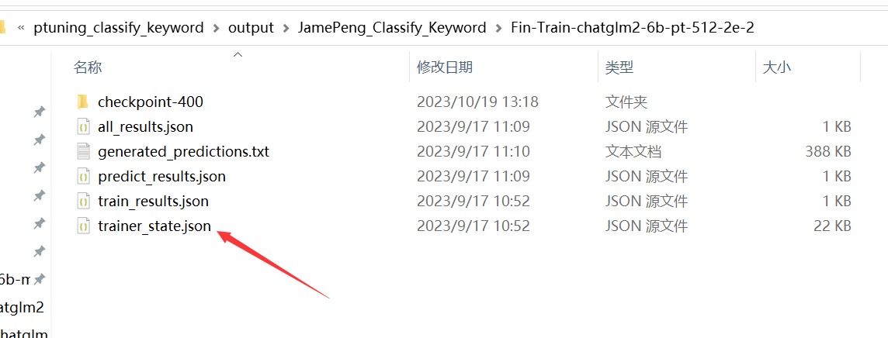</div>

        ```python
        import matplotlib as mpl
        import matplotlib.pyplot as plt
        import matplotlib.ticker as mticker
        import json

        trainer_state_path = "./trainer_state.json"
        with open(trainer_state_path, 'r', encoding='utf-8') as tfp:
            trainer_state_data = json.load(tfp)

        # 提取json文件中的log_history数组字典
        log_history = trainer_state_data['log_history']
        # print(log_history)

        # 提取 epoch 和 loss 的数值使用
        epochs = []
        learning_rate = []
        losses = []
        steps = []

        for log in log_history[:-1]:
            epochs.append(log["epoch"])
            learning_rate.append(log["learning_rate"])
            losses.append(log["loss"])
            steps.append(log["step"])


        # 创建损失曲线图
        plt.figure(figsize=(10, 6))
        plt.plot(epochs, losses, marker='o', linestyle='-', color='b', label='Loss')
        plt.xlabel('Epoch')
        plt.ylabel('Loss')
        plt.title('JamePeng train loss line')

        # 使用逗号作为千分位分隔符，并保留3位小数
        plt.gca().yaxis.set_major_formatter(mticker.StrMethodFormatter('{x:,.4f}'))

        plt.legend()
        plt.grid(True)
        plt.show()
        ```

        <div align=center>
        <br/>*通过图像就可以比较直观的观察loss曲线的情况，有助于我们调整训练任务的细节</div>

3. 过拟合处理： 如果观察到模型出现过拟合，一般是数据量太小，可以尝试把一类任务的训练集提到200条左右

4. 分布式训练： 对于大规模数据和模型训练，有条件的情况下，考虑使用分布式训练来加速训练过程。

---